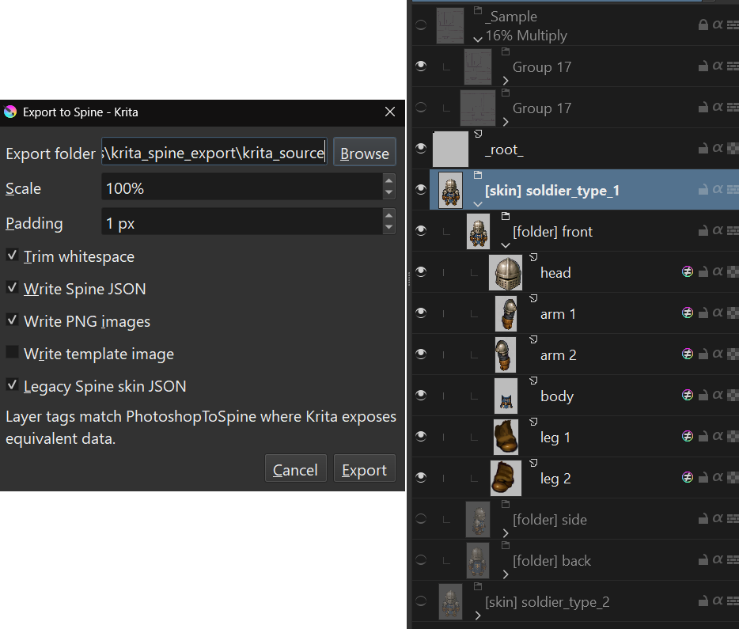

# Krita Spine Export

Krita Spine Export is a Krita Python plugin that exports document layers as PNG attachments plus Spine JSON.

## Usage

Save the Krita document, then run **Tools > Scripts > Export to Spine...**. Choose an **export folder**, scale, padding, and export options, then press **Export**.

The Krita file name determines the export location:

- A `kritaFileName` folder is created inside the export folder (without the file extension).
- The Spine JSON is written into the `kritaFileName` folder as `kritaFileName.json`.
- Images are written into an `images` folder inside the `kritaFileName` folder.

All exportable layers under the document root are exported, **both visible and hidden**. Root-level groups and layers whose names start with `_` are skipped, except that `_root_` can still be used as the origin marker.

The exporter writes:

- PNG files for exportable layers and `[merge]` groups. By default, each image and attachment name is prefixed with its immediate parent group name, for example `front_head.png`.
- Spine JSON with `bones`, `slots`, `skins`, and an empty animation.
- Optional `template.png` from the current document projection.

## Root Marker

A layer named `_root_` anywhere in the document can be used as an origin marker, even when it is outside the exported layer groups. The marker layer is not exported as a PNG or attachment. Its visible pixel bounds are used to find the marker center, and that point becomes Spine `0,0`; all exported attachment and bone positions are offset relative to it.

Use a single visible dot on the `_root_` layer for the clearest result. If more than one `_root_` marker layer exists, export is cancelled.

## Supported Tags

Tags can be placed in layer or group names using the same square-bracket style as PhotoshopToSpine.

- `[bone]` or `[bone:name]`
- `[slot]` or `[slot:name]`
- `[skin]` or `[skin:name]`
- `[folder]` or `[folder:name]`
- `[scale:number]`
- `[trim]` or `[trim:false]`
- `[mesh]` or `[mesh:name]`
- `[ignore]`
- `[merge]` on groups
- `[name:pattern]` on groups, where `pattern` contains `*`
- `[path:name]` on layers or merged groups